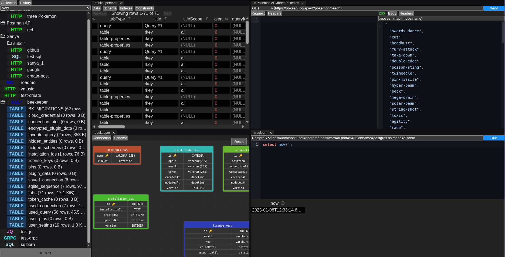

# apiary


A desktop API client that speaks HTTP, SQL, gRPC, Redis, and more — all in one window. No more switching between Postman, TablePlus, RedisInsight, and a terminal for `jq`.

- **Seven protocols, one app.** HTTP requests, SQL queries (MySQL, PostgreSQL, SQLite, ClickHouse), gRPC calls, Redis commands, `jq` JSON filtering, Markdown preview, and DIFF comparisons — without leaving the window.
- **Source plugins.** Import OpenAPI specs as browsable API collections, or connect a SQL database and explore tables like endpoints.
- **JSON database.** Your requests and responses live in a simple `db.json` file — easy to version-control, diff, and backup.
- **Vanilla TypeScript.** Built with Electron, GoldenLayout, and CodeMirror. No React, no Vue, no framework overhead.



## Getting started

### Download

Grab the latest binary from [GitHub Releases](https://github.com/rprtr258/apiary/releases):

| Platform | File |
|----------|------|
| Linux (x64) | `apiary-linux-x64.AppImage` |
| macOS (Intel) | `apiary-darwin-x64.dmg` |
| macOS (Apple Silicon) | `apiary-darwin-arm64.dmg` |
| Windows (x64) | `apiary-win-x64.exe` |

Make it executable (Linux/macOS):

```bash
chmod +x apiary-linux-x64.AppImage
./apiary-linux-x64.AppImage
```

### Build from source

```bash
# Prerequisites: Bun 1.3.14+
git clone https://github.com/rprtr258/apiary.git
cd apiary
bun install
bun run dist          # builds for current platform
# Binary lands in release/
```

### Development servers (optional)

Docker Compose spins up test services for local development:

```bash
docker compose up -d     # MySQL, PostgreSQL, Redis, gRPC, PetStore API
```

## How it works

Launch apiary, and it creates a `db.json` file in the current directory. Each request is a row with a kind tag (http, sql, grpc, redis, jq, md, diff) and its parameters. The UI is a tabbed workspace powered by [GoldenLayout](https://golden-layout.com/) with [CodeMirror](https://codemirror.net/) editors.

## Development

```bash
bun run dev              # dev server with hot reload
bun run build            # production build
bun run lint             # check linting
bun run typecheck        # check types
bun run test             # run unit tests
bun run test:e2e         # run Playwright E2E tests
bun run ci               # lint + typecheck + tests
```

### Project structure

```
main/                   # Electron main process
├── api.ts              # IPC handlers
├── db.ts               # JSON database
├── database/           # Protocol implementations
│   ├── http.ts         ─ sendHTTP()
│   ├── sql.ts          ─ sendSQL()
│   ├── grpc.ts         ─ sendGRPC()
│   ├── redis.ts        ─ sendRedis()
│   ├── jq.ts           ─ sendJQ()
│   ├── md.ts           ─ sendMD()
│   ├── diff.ts         ─ sendDIFF()
│   ├── http_source.ts  ─ OpenAPI source plugin
│   └── sql_source.ts   ─ SQL source plugin
renderer/               # Electron renderer process
├── App.ts              ─ main application
├── Request*.ts         ─ per-protocol request editors
├── Sidebar.ts          ─ navigation
└── components/         ─ shared UI components
shared/                 # Shared between main and renderer
└── types/              ─ protocol type definitions
```

## Creating a release

```bash
git tag v0.0.4
git push origin v0.0.4
```

GitHub Actions builds binaries for all platforms and publishes a release.
